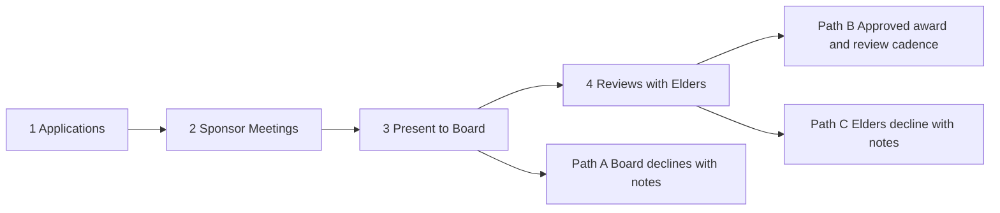

# Process Overview

**Program:** SBC Scholarship and Business-Startup Program (S&BSP)  
**Date captured:** 2026-07-24 · **Updated:** 2026-08-11  
**Status:** Working process note for planning team  
**Graphic:** [`assets/process-ceremony-overview-ltr.png`](../assets/process-ceremony-overview-ltr.png) · [`assets/process-ceremony-overview.svg`](../assets/process-ceremony-overview.svg)

---

## Prerequisite

After **announcements** are made and the **recruitment strategy** has begun.

## Flow

Main spine (left → right):

1. **Applications** — Prospective recipients submit via **Typeform**
2. **Sponsor meetings** — Board assigns a Sponsor; meet, plan, prepare docs
3. **Present to board** — Sponsor presents the applicant and plan
4. **Reviews with Elders** — Elder evaluation
5. **Path B — Approved / award money** — Assign Sponsor / Board cadence of review meetings

Side exits:

- **Path A** (after Present to Board) — Board declines with notes
- **Path C** (after Reviews with Elders) — Elders decline with notes

## Sponsor role (board member)

- Assigned by the board to a specific applicant
- Owns discovery: questions, understanding need and path
- Produces support plan and docs ready for board
- Presents to the board
- On Path B approval: continues with a cadence of review meetings with the board

## Open questions

- After a decline with notes (Path A or C): revise/re-enter, or terminal for the cycle?
- What the Sponsor / Board review-meeting cadence looks like after award
