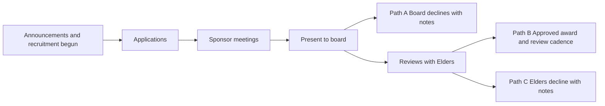

# Process Overview

**Program:** SBC Scholarship and Business-Startup Program (S&BSP)  
**Date captured:** 2026-07-24 · **Updated:** 2026-08-11  
**Status:** Working process note for planning team  
**Graphic:** [`assets/process-ceremony-overview-ltr.png`](../assets/process-ceremony-overview-ltr.png) · [`assets/process-ceremony-overview.svg`](../assets/process-ceremony-overview.svg)

---

## Prerequisite

After **announcements** are made and the **recruitment strategy** has begun.

## Flow

1. **Applications** — Prospective recipients submit applications via **Typeform**.
2. **Sponsor meetings** — The board assigns a **Sponsor** (a person from the board) to:
   - Meet with the applicant
   - Ask questions and understand the request
   - Develop a support plan and supporting docs
   - Prepare the case for board presentation
3. **Present to board** — Sponsor presents the applicant and support plan to the board.
4. **Board path** — One of:
   - **Path A — Board declines with notes** — Board declines and records notes (feedback / rationale)
   - **Reviews with Elders** — Board takes the case to the Elders for review
5. **After Elder review** — One of:
   - **Path B — Approved / award money** — Award funds and assign Sponsor / Board cadence of review meetings
   - **Path C — Elders decline with notes** — Elders decline and record notes

## Sponsor role (board member)

- Assigned by the board to a specific applicant
- Owns discovery: questions, understanding need and path (trade / family craft / college)
- Produces support plan and docs ready for board
- Presents to the board
- On Path B approval: continues with a cadence of review meetings with the board

## Open questions

- After a decline with notes (Path A or C): is the applicant/sponsor expected to revise and re-enter, or is that a terminal outcome for the cycle?
- Timing: how the committee “X week” review from the initial proposal maps onto Sponsor meetings vs. board / Elder stages
- What the Sponsor / Board review-meeting cadence looks like after award (frequency, duration, reporting)
